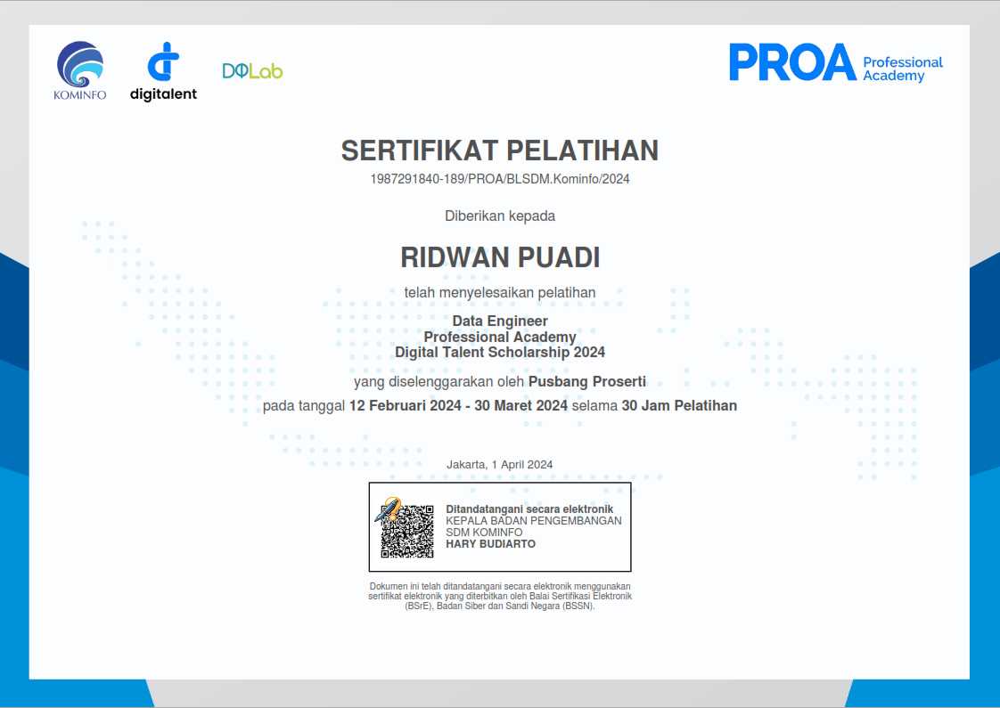
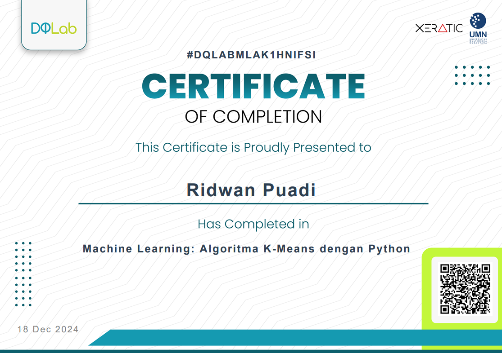
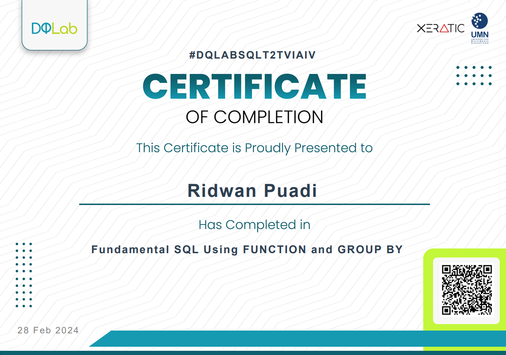

# DQLab Academy

[DQLab Academy](https://academy.dqlab.id/) adalah platform pembelajaran online yang berfokus pada pengembangan keterampilan di bidang data, termasuk analisis data, ilmu data, dan kecerdasan buatan. Platform ini menawarkan berbagai modul dan bootcamp untuk membantu kamu meningkatkan kompetensi di bidang tersebut.

*Catatan* : Code yang ada di repo ini adalah milik dari [Muhammad Yusuf Aristyanto](https://www.linkedin.com/in/yusufarist/)  yang sudah saya modifikasi sesuai dengan kebutuhan belajar saya.

---

## 📚 Modul Pembelajaran

DQLab menyediakan berbagai modul pembelajaran yang dirancang untuk membantu kamu memahami konsep dan teknik dalam analisis data. Beberapa modul yang tersedia antara lain:

- **Guide to Learn R with AI at DQLab**  
  Modul pengenalan R yang interaktif dan didukung oleh AI menggunakan metode HERO (Hands-On, Experiential Learning, and Outcome-Based) untuk membantu kamu memperoleh manfaat maksimal dari seluruh materi yang tersedia di DQLab. 

- **Guide to Learn Python with AI at DQLab**
  Modul ini dirancang untuk membantu pemula memahami dasar-dasar bahasa pemrograman Python dengan pendekatan interaktif yang didukung oleh AI. kamu akan belajar konsep fundamental seperti variabel, tipe data, struktur kontrol, fungsi, serta eksplorasi data menggunakan pustaka Python populer seperti Pkamus dan Matplotlib.

- **Guide to Learn SQL with AI at DQLab**  
  Modul pengenalan SQL yang interaktif dan didukung oleh AI, dirancang untuk membantu kamu memahami dasar-dasar SQL dengan metode pembelajaran yang efektif. 

- **Guide to Learn Pentaho with AI at DQLab**
  Modul ini memberikan pengenalan tentang penggunaan Pentaho, sebuah alat Business Intelligence (BI) yang digunakan untuk integrasi data, ETL (Extract, Transform, Load), serta analisis data. Dengan bimbingan AI, kamu akan belajar bagaimana mengelola dan menganalisis data secara efisien menggunakan Pentaho Data Integration (PDI) untuk membangun alur kerja otomatis dalam pengolahan data.

---

## 🚀 Bootcamp di DQLab 

DQLab juga menawarkan program bootcamp intensif untuk memperdalam keterampilan kamu dalam analisis data. Beberapa bootcamp yang tersedia antara lain:

### 📊 Bootcamp Data Analyst with SQL & Python in Google Platform  
Bootcamp ini dirancang untuk mengasah kemampuan kamu dalam menggunakan SQL dan Python untuk analisis data di platform Google.  

  

  

### 📈 Mini Bootcamp: Introduction to Data Analytics  
Bootcamp pengantar yang memberikan pemahaman dasar tentang analisis data menggunakan berbagai alat dan teknik.  

  

  

---

## 🎓 Sertifikat

Setelah menyelesaikan modul atau bootcamp, kamu akan mendapatkan sertifikat sebagai pengakuan atas pencapaian kamu. Sertifikat ini dapat digunakan untuk meningkatkan portofolio profesional kamu.

  
  

  <b>Data Engineer</b> &nbsp;&nbsp;&nbsp;&nbsp;
  <b>Completion R</b>

  
  

  <b>Completion Python</b> &nbsp;&nbsp;&nbsp;&nbsp;
  <b>Completion SQL</b>

---

## 🛠️ Fitur Tambahan

- **Two-Factor Authentication (2FA)**  
  DQLab menyediakan fitur 2FA untuk meningkatkan keamanan akun kamu. kamu dapat mengaktifkan 2FA melalui pengaturan akun di platform.

---

## 📞 Kontak

Untuk informasi lebih lanjut, kunjungi situs resmi [DQLab Academy](https://academy.dqlab.id/) atau hubungi tim dukungan mereka melalui halaman kontak di situs tersebut.

---

*Catatan: Informasi di atas disusun berdasarkan data yang tersedia hingga saat ini. Untuk informasi terbaru, silakan kunjungi situs resmi DQLab Academy.*
